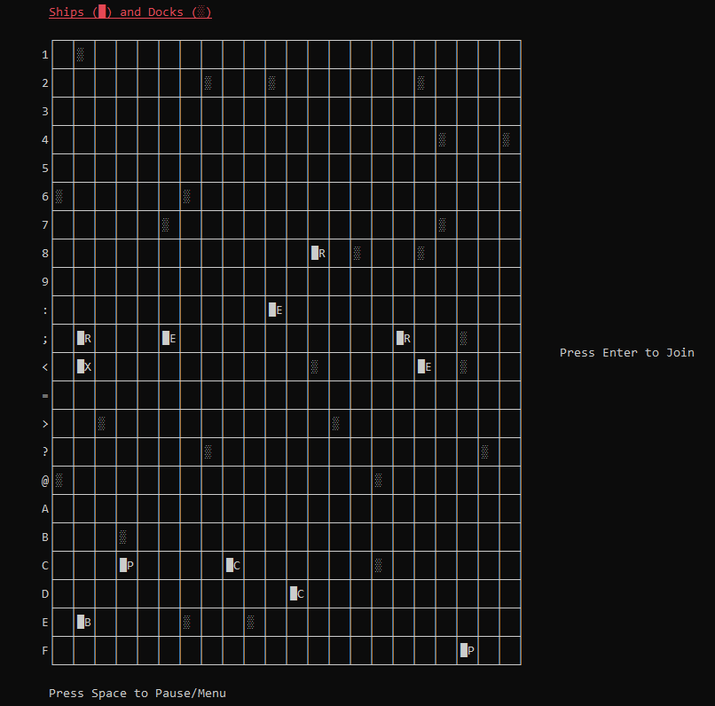
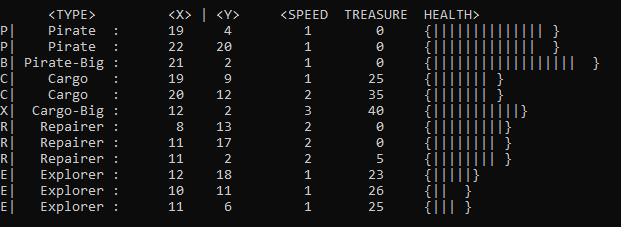
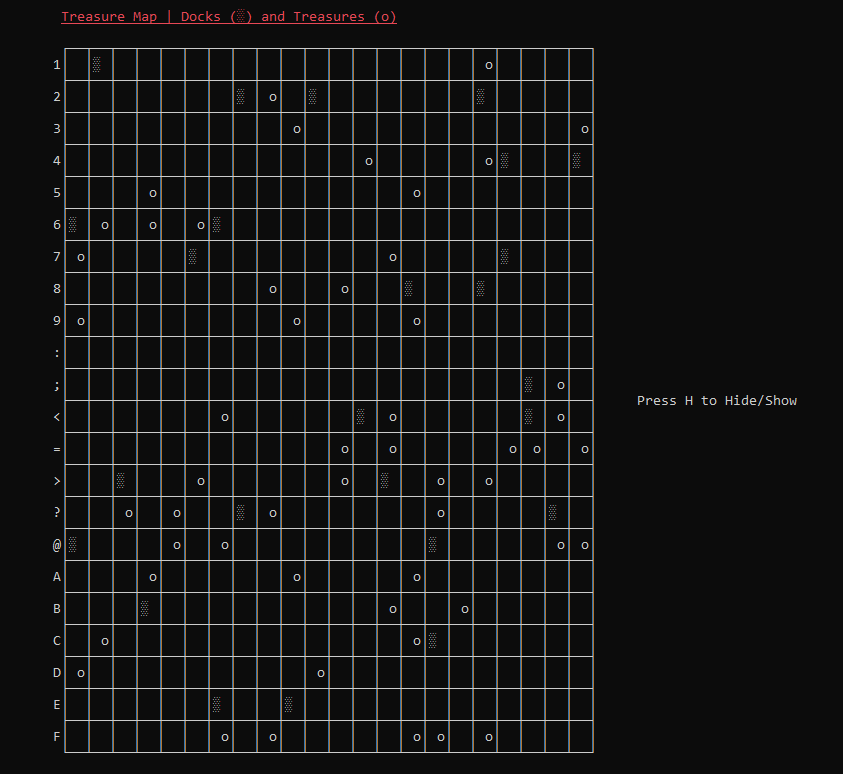

# Ship Game

A Ship Simulation Game in C++.

Everything in the Simulation uses the Mersenne Twister number generator instead of C++'s built-in generator ( http://www.math.sci.hiroshima-u.ac.jp/~m-mat/MT/emt.html )

Map Size can be as <b>huge</b> as the user wants it to be.

Drawing a scalable Grid in C++:

    void World::DrawShipsMap() ...

Returning which directions are blocked just with 1 Integer    
  
    (appendedDirections / 1000 % 10, appendedDirections / 100 % 10, appendedDirections / 10 % 10, appendedDirections % 10)

*PHOTO FULL*    
    
*MAP 1*

*MAP 2*
    
    
Abilities of each Ship Type:

Ship::Pirate & Ship::BigPirate  :  Attacks nearby ships damages them and steals a piece of their treasure.
    Stats: Damage = 1, Speed = 1, Health = 15-20, StartingTreasure = 0 
    
Ship::Cargo & Ship::BigCargo  :  Increases the amount of treasure its carrying when next to a Dock.
    Stats: Damage = 0, Speed = 1-3, Health = 8, StartingTreasure = 1-40

Ship::Repairer  :  Repairs a nearby ship by increasing its health, in exchange for treasure.
    Stats: Damage = 0, Speed = 1-3, Health = 9, StartingTreasure = 0, Repair = 3

Ship::Explorer  :  Has 50% chance of withstanding Environment damage.
    Stats: Damage = 0, Speed = 1, Health = 4, StartingTreasure = 1-35
    
Abilities of Environment:

   Treasure Chests  :  Can be picked up by Ships
     Value: 2
   Docks  :  Damages nearby Ships if they are Pirates, else repairs Ships
     Value: 1
   Weather  :  Damages a nearby Ship. Weather changes each Round
     Value: 1
     
    Dead Ships are converted to Treasure Chests
